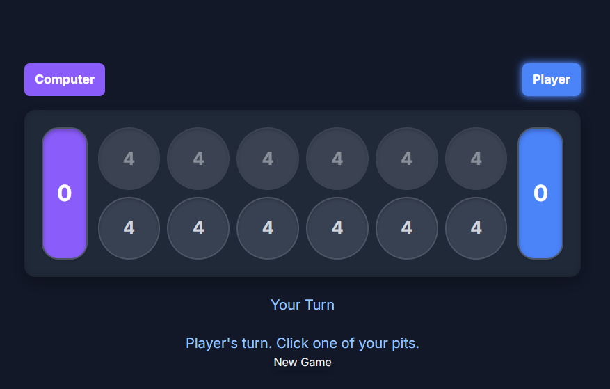

# Mancala Game: Player vs. Computer

A classic Mancala board game implemented in HTML, CSS, and JavaScript, allowing a human player to compete against a basic computer AI. This project features a modern, responsive design and simplified Mancala rules for straightforward gameplay.

Play the game live on GitHub Pages: [https://yaredwb.github.io/mancala_game/](https://yaredwb.github.io/mancala_game/)

## Preview


*(Screenshot of the Mancala game.)*

## Features

* **Player vs. Computer:** Play against a computer opponent.
* **Classic Mancala Board:** Standard layout with 6 pits per player and one store (Mancala) each.
* **Simplified Rules:**
    * Seeds are sown one by one in a counter-clockwise direction.
    * Player's seeds skip the opponent's store.
    * No extra turns for landing in your own store.
    * No capture rule for landing in an empty pit.
* **Turn-Based Gameplay:** Clear indication of whose turn it is.
* **Seed Sowing Animation:** Visual feedback as seeds are distributed.
* **Game Over Detection:** Automatically detects when one side has no more seeds in their pits.
* **Final Score Calculation:** Remaining seeds are collected, and the winner is declared.
* **Responsive Design:** Adapts to different screen sizes for play on desktop and mobile devices.
* **Modern UI:** Clean and intuitive interface with a dark theme.
* **"New Game" Functionality:** Easily restart the game at any time.

## How to Play

1.  **Objective:** Collect more seeds in your Mancala (store) than your opponent.
2.  **Board Setup:** The game starts with 4 seeds in each of the 12 smaller pits. The player's pits are on the bottom row, and their Mancala is the large store to their right. The computer's pits are on the top row, and its Mancala is the large store to its left.
3.  **Your Turn:**
    * Click on one of your 6 pits that contains seeds.
    * All seeds from that pit are picked up.
    * Starting from the next pit to the right (counter-clockwise), one seed is dropped into each subsequent pit.
    * If sowing passes over your own Mancala, a seed is dropped into it.
    * Sowing *skips* the opponent's Mancala.
4.  **Computer's Turn:** The computer will automatically make its move after you.
5.  **Game End:** The game ends when all 6 pits on one player's side are empty. The player who still has seeds on their side of the board collects all of those seeds into their Mancala.
6.  **Winner:** The player with the most seeds in their Mancala at the end of the game wins.

## Technologies Used

* **HTML:** Structure of the game.
* **CSS (Tailwind CSS):** Styling for the modern look and feel, and responsiveness.
* **JavaScript:** Game logic, player interaction, AI, and DOM manipulation.
* **Google Fonts (Inter):** For modern typography.

## Accessing the Game

You can play the game directly in your web browser by visiting the following link:

[**Play Mancala Game on GitHub Pages**](https://yaredwb.github.io/mancala_game/)

No special build steps or dependencies are required beyond a modern web browser. If you wish to view or modify the code, you can clone the repository:

1.  Clone the repository:
    ```bash
    git clone https://github.com/yaredwb/mancala_game.git
    ```    
2.  Navigate to the project directory:
    ```bash
    cd mancala_game
    ```
3.  Open the `index.html` file in your web browser.

## Code Structure

* **`index.html` (or main HTML file):** Contains the HTML structure, CSS styles (inline or linked), and JavaScript game logic.
    * **CSS:** Defines the visual appearance of the board, pits, stores, messages, and buttons. Uses Tailwind CSS utility classes for rapid styling.
    * **JavaScript:**
        * `PLAYER_PITS_INDICES`, `PLAYER_STORE_INDEX`, etc.: Constants defining board layout and indices.
        * `boardState`: Array representing the number of seeds in each pit and store.
        * `initializeGame()`: Sets up the board for a new game.
        * `renderFullBoard()`: Updates the visual display of the board based on `boardState`.
        * `createPitElement()`, `createStoreElement()`: Helper functions for creating DOM elements.
        * `handlePlayerMove()`: Processes the player's click on a pit.
        * `processSow()`: Manages the distribution of seeds.
        * `finalizeMove()`: Switches turns and checks for game over conditions after sowing.
        * `initiateComputerMove()`: Contains the logic for the computer's turn.
        * `checkIfGameOver()`: Determines if the game has ended.
        * `triggerEndGame()`: Collects remaining seeds and declares the winner.

## Future Enhancements (Optional)

* More advanced computer AI.
* Option to choose different starting numbers of seeds.
* Sound effects for moves and game events.
* Highlighting valid moves for the current player.
* Player vs. Player mode.

*This Mancala game code was developed by Gemini 2.5 Pro with guidance from me.*
